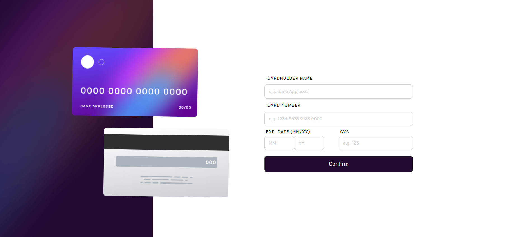

# Interactive Card Details Form

> A form that enables users to input card details and provides real-time updates.
> Live demo [_here_](https://Lukass9.github.io/card/).

## Table of Contents

- [General Info](#general-information)
- [Technologies Used](#technologies-used)
- [Features](#features)
- [Screenshots](#screenshots)
- [Setup](#setup)
- [Acknowledgements](#acknowledgements)
- [Contact](#contact)

## General Information

- This project allows users to input card details into an interactive form with real-time updates, aimed at facilitating seamless input and validation of card information.
- The primary goal is to create a user-friendly experience by enabling smooth handling and validation of card details within the form.
- The project serves as a practice ground for interactive form handling and validation techniques.

## Technologies Used

- React - v18.2.0
- Styled Components - v5.3.6
- Framer Motion - v10.6.0
- TypeScript - v4.9.5

<div align="center">
	<code></code>
    <code></code>
    <code></code>
	<code></code>
</div>

## Features

- Real-time update of card details upon form completion.
- Error message display for incorrect input or empty fields.
- Responsive layout adapting to various screen sizes.

## Screenshots

### Desktop




### Mobile


### Validation


## Setup

The project's dependencies and requirements are listed in the `package.json` file. To set up the project locally:

1. Clone the repository:

```bash
  git clone https://github.com/your-repository.git
```

2. Install dependencies:

```bash
   cd your_project_directory
    npm install  # or yarn install if using Yarn
```

3. Start the application:

```bash
  npm run start  # or yarn start if using Yarn
```

## Acknowledgements

- This project was inspired by frontendmentor.

## Contact

Created by [@Lukass9](https://github.com/Lukass9) - feel free to contact me!
